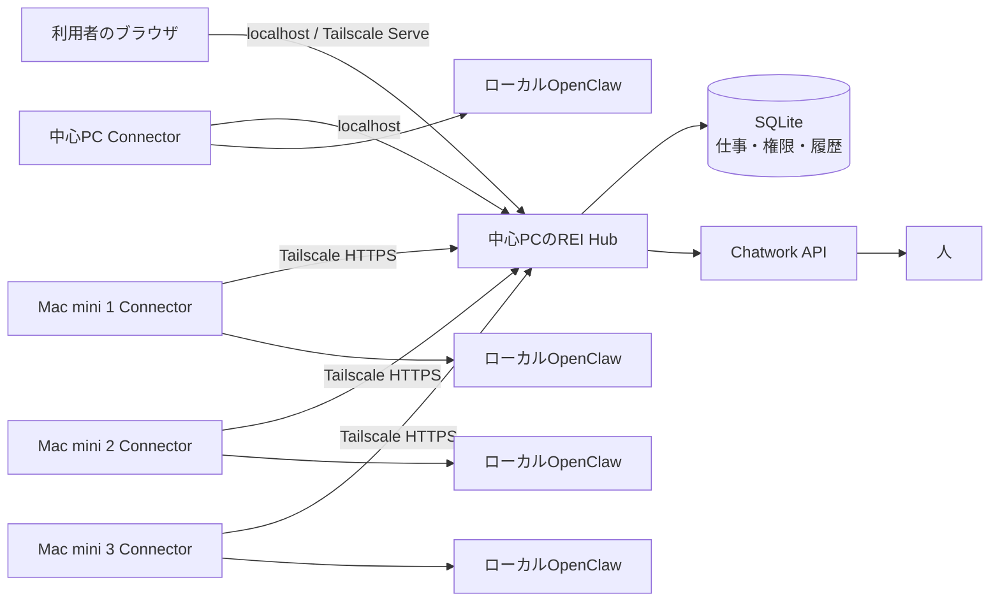
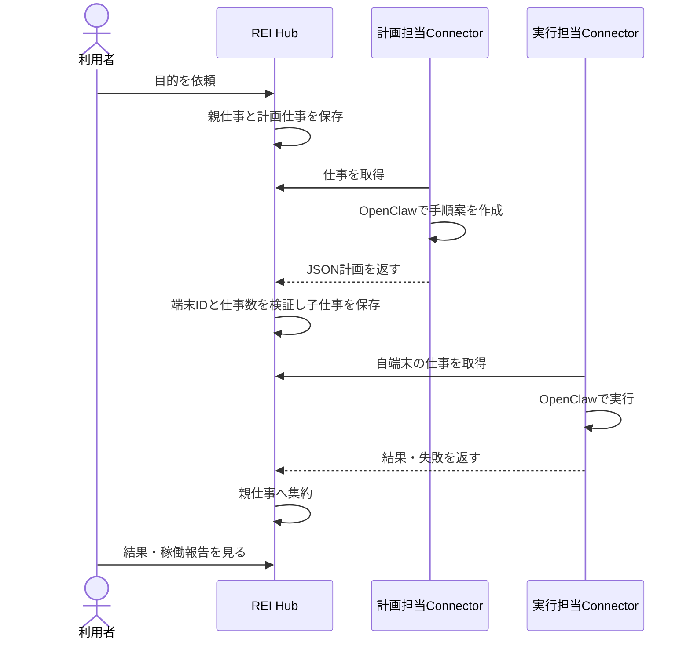

# REI ローカル版の設計図

## 役割

- **Hub:** 仕事の唯一の記録元。ログイン、権限、端末登録、割当、報告、Chatworkを管理する。既定は `127.0.0.1:4178` のみで待ち受ける。
- **Connector:** 各PCで常駐。端末専用トークンでHubへ接続し、仕事を取得して、そのPCのOpenClawへ渡す。初回のかんたん端末追加では、そのPCにREI用エージェントを作る。別PCへ直接接続は行わない。
- **OpenClaw:** 計画担当と実行担当。新しい参加PCでは専用の `rei` エージェントを作成する。既存の `main` が不要なら、作業場所と表示名をREI用に変更して使うこともできる。REI用エージェントに明示的なツールプロファイルがなければ `coding` を設定し、直接メッセージ送信とGateway管理ツールを無効にする。既存の明示的なプロファイルは保持する。
- **Chatwork:** 人へ渡す仕事の投稿・返信取得。APIトークンはHubのローカル暗号鍵で暗号化して保存。
  返信は仕事IDと投稿者アカウントを照合する。複数の異なる仕事IDが含まれる投稿、REI自身の投稿、投稿者不明のメッセージは回答としない。投稿IDが取得できない場合は送信結果不明として人の確認を待つ。

遠隔接続の案内はTailscale ServeのHTTPSルート `/` がこのHubのローカルポートへ向く場合だけ表示する。同じ入口にFunnelが有効なら公開接続として警告し、参加PC用URLを案内しない。既存の `/` ルートが別のサービスを指す場合も自動上書きしない。

## 仕事の流れ

## 接続と故障時の扱い

計画で分けた工程は複数PCで同時に開始し得る。計画担当には独立した工程だけを分け、順序が必要な作業は一つの工程にまとめるよう指示する。計画が存在しないPCを指定したり13工程以上を返した場合は実行せず「要確認」にする。
計画担当には登録端末のID・名前・OpenClawエージェント名・接続状態・機能を渡す。端末を指定する場合は接続中のPCを優先し、停止中のPCへ任せる工程には待機理由を含める。

1. Hubは端末登録時にランダムなトークンを一度だけ発行し、DBにはハッシュを保存する。
2. Connectorは空き時間に約15秒ごと、OpenClawでの仕事中は10秒ごとに心拍し、空き時間は約3秒ごとに仕事を取得する。
3. 取得した仕事には4分の期限を設け、処理中は30秒ごとに更新する。
   OpenClawの1工程の実行期限は既定で30分、設定可能範囲は1分〜2時間。実行中もConnectorは心拍と取得期限の更新を続け、OpenClawの期限後も終了しないプロセスは停止させる。
4. 計画の取得期限が切れた場合は最大3回まで再試行する。実行仕事で結果が不明になった場合は自動再実行せず「要確認」にする。期限切れ工程、親仕事、履歴の更新は一括で保存する。
5. 端末トークンを解除するとその端末の新しい通信は拒否される。
6. Chatworkへの送信開始は仕事の状態と履歴を一括保存できた後だけ行う。投稿後のID・仕事の状態・履歴も一括保存し、結果が不明なら二重投稿を避けるため「要確認」にする。送信中にHubが落ちた場合も、再起動後に送信開始から60秒が経つと「要確認」に移す。
7. 計画担当PCの心拍が30秒以上途絶えた場合、計画機能のある接続中の別PCが新しい計画を引き継ぐ。実行中の仕事は自動再実行しない。
8. OpenClawのCLIが正常終了しても、返答の処理状態が失敗または中断なら完了扱いにしない。ツール失敗の明示的な返答も「要確認」に送る。
9. 結果保存後に応答だけが失われた場合、同じ端末・取得期限ID・結果の再送は保存済みとして応答し、履歴を重複作成しない。実行工程が期限切れで「要確認」になった後に元の端末から結果が届いた場合、報告を別に保存し、自動で完了にはせず人が実施状況を確認する。人が先に確認を終えた場合も、遅れて届いた報告を保存して仕事を再び「要確認」にする。
10. ConnectorはHubが結果を受理したと確認できるまで、`pending-results.json` の送信待ち結果を消さず、次の仕事も取得しない。Hubが照合を拒否した場合は記録を保持して再試行し、心拍で送信待ち件数をHubへ知らせる。司令室と端末設定画面で件数を表示する。
11. 送信待ち結果が壊れている、または保存途中の `.tmp` が残っている場合、Connectorは起動を止めてファイルを保持する。保存に失敗した場合も仕事を続けず停止する。
12. 実行中のPCを解除したときは、そのPCが持つ仕事の期限を直ちに切らす。計画は再試行可能なら別PCへ戻し、実行工程は二重実行を防ぐため「要確認」にする。
13. Hubと同じREI版を報告していないConnectorは、版番号がない古い端末も含めて新しい仕事を取得できない。心拍と実行結果の返送は受け付け、更新が必要なことを端末画面とログに表示する。

## データと権限

SQLiteはWALモード。プロジェクト、仕事、子仕事、端末、利用者、イベントを持つ。プロジェクトの目的は計画担当と実行担当のOpenClawへ渡す。ブラウザにはHttpOnly・SameSite=StrictのセッションCookieを使う。所有者/管理者はプロジェクトを作成・変更し、仕事を直接依頼できる。依頼者の仕事は承認後に実行し、閲覧者は参照のみ。HubのREST APIが権限を検査する。

この権限は**Hubへの依頼権限**であり、OpenClawが持つOS上の権限を細かく制限するものではない。専用エージェントでも、許可されたツールからOSのファイルを操作できる。顧客配布時は端末ごとにOpenClawのツール権限と実行ディレクトリを個別に設定する。

## 配布形態

依存パッケージを必要としないNode.jsアプリ。GitHubにはソース、導入手順、テストだけを載せる。`data/`、Chatworkトークン、端末トークン、仕事履歴は `.gitignore` で除外する。新規利用者は自分のPCでHubを起動し、初回登録から始められる。

macOSはLaunchAgent、Windowsはスタートアップ登録、LinuxはsystemdユーザーサービスでHubとConnectorを自動起動できる。各OSの設定は利用者自身のアカウント内に保存する。
