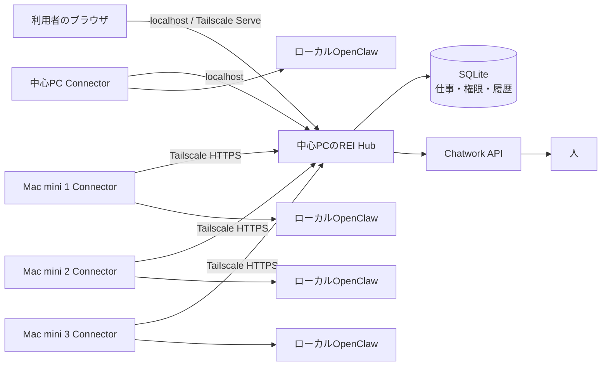
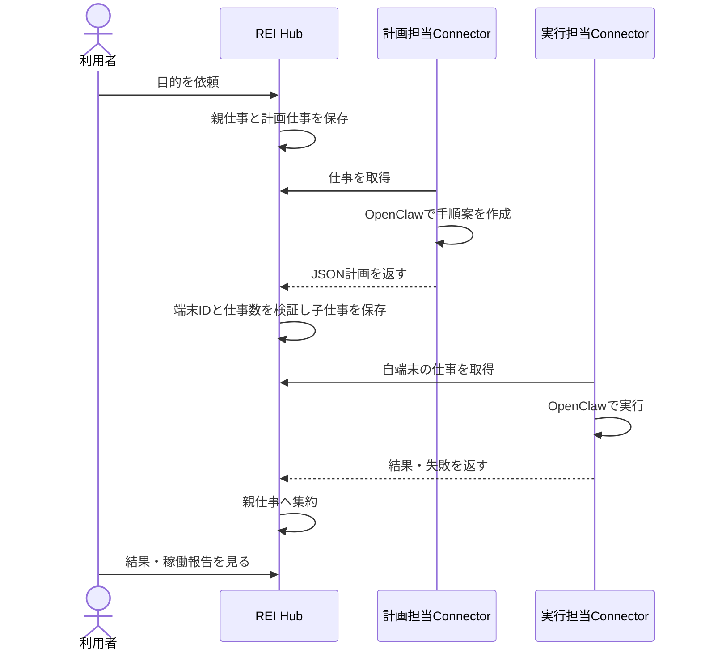

# REI ローカル版の設計図

## 役割

- **Hub:** 仕事の唯一の記録元。ログイン、権限、端末登録、割当、報告、Chatworkを管理する。既定は `127.0.0.1:4178` のみで待ち受ける。
- **Connector:** 各PCで常駐。端末専用トークンでHubへ接続し、仕事を取得して、そのPCのOpenClawへ渡す。初回のかんたん端末追加では、そのPCにREI用エージェントを作る。別PCへ直接接続は行わない。
- **OpenClaw:** 計画担当と実行担当。新しい参加PCでは専用の `rei` エージェントを作成する。既存の `main` が不要なら、作業場所と表示名をREI用に変更して使うこともできる。REI用エージェントでは直接メッセージ送信とGateway管理ツールを無効にする。
- **Chatwork:** 人へ渡す仕事の投稿・返信取得。APIトークンはHubのローカル暗号鍵で暗号化して保存。

## 仕事の流れ

## 接続と故障時の扱い

1. Hubは端末登録時にランダムなトークンを一度だけ発行し、DBにはハッシュを保存する。
2. Connectorは15秒ごとに心拍し、空き時間は約3秒ごとに仕事を取得する。
3. 取得した仕事には4分の期限を設け、処理中は30秒ごとに更新する。
4. 計画の取得期限が切れた場合は最大3回まで再試行する。実行仕事で結果が不明になった場合は自動再実行せず「要確認」にする。
5. 端末トークンを解除するとその端末の新しい通信は拒否される。
6. Chatwork送信の結果が不明なら二重投稿を避けるため「要確認」にする。
7. 計画担当PCの心拍が30秒以上途絶えた場合、計画機能のある接続中の別PCが新しい計画を引き継ぐ。実行中の仕事は自動再実行しない。

## データと権限

SQLiteはWALモード。プロジェクト、仕事、子仕事、端末、利用者、イベントを持つ。プロジェクトの目的は計画担当と実行担当のOpenClawへ渡す。ブラウザにはHttpOnly・SameSite=StrictのセッションCookieを使う。所有者/管理者はプロジェクトを作成・変更し、仕事を直接依頼できる。依頼者の仕事は承認後に実行し、閲覧者は参照のみ。HubのREST APIが権限を検査する。

この権限は**Hubへの依頼権限**であり、OpenClawが持つOS上の権限を細かく制限するものではない。専用エージェントでも、許可されたツールからOSのファイルを操作できる。顧客配布時は端末ごとにOpenClawのツール権限と実行ディレクトリを個別に設定する。

## 配布形態

依存パッケージを必要としないNode.jsアプリ。GitHubにはソース、導入手順、テストだけを載せる。`data/`、Chatworkトークン、端末トークン、仕事履歴は `.gitignore` で除外する。新規利用者は自分のPCでHubを起動し、初回登録から始められる。
