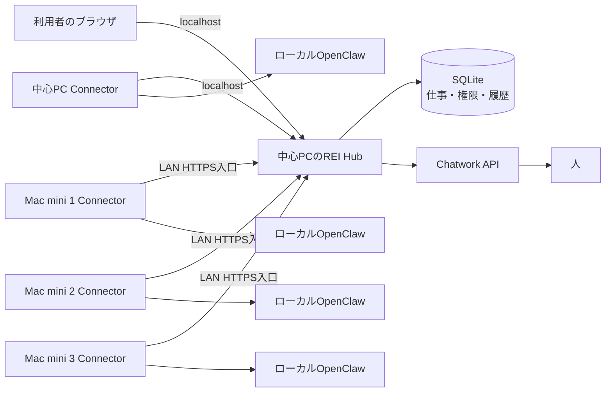
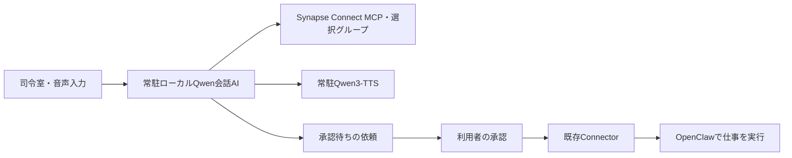
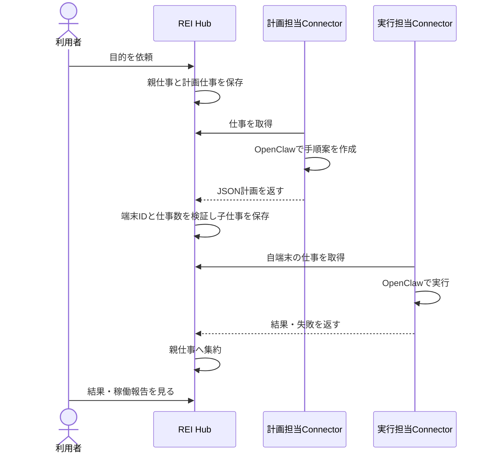

# REI ローカル版の設計図

```mermaid
flowchart LR
  U[利用者のブラウザ] -->|localhost| H[中心PCのREI Hub]
  H --> D[(SQLite<br/>仕事・権限・履歴)]
  H --> C[Chatwork API]
  A[中心PC Connector] -->|localhost| H
  B[Mac mini 1 Connector] -->|LAN HTTPS入口| H
  E[Mac mini 2 Connector] -->|LAN HTTPS入口| H
  F[Mac mini 3 Connector] -->|LAN HTTPS入口| H
  A --> OA[ローカルOpenClaw]
  B --> OB[ローカルOpenClaw]
  E --> OE[ローカルOpenClaw]
  F --> OF[ローカルOpenClaw]
  C --> P[人]
```

## 会話と仕事の分離（0.5.39）

```mermaid
flowchart LR
  UI[司令室・音声入力] --> CHAT[常駐ローカルQwen会話AI]
  CHAT --> MCP[Synapse Connect MCP・選択グループ]
  CHAT --> VOICE[常駐Qwen3-TTS]
  CHAT --> DRAFT[承認待ちの依頼]
  DRAFT --> APPROVAL[利用者の承認]
  APPROVAL --> CONNECTOR[既存Connector]
  CONNECTOR --> WORK[OpenClawで仕事を実行]
```

Hubの`conversation/ask`はConnectorのAIジョブを作らず、MLXの4bit会話モデルを常駐させて返答する。モデルはJSONで操作を提案し、サーバーが読み取りツール4種類・選択グループ・取得済みID・検索2回の上限を強制する。出典が追跡できない検索結果を確定情報として返さない。MCP認証と通信だけは同梱OpenClaw 2026.7.1の内部ランタイムを再利用するため、同バージョンに依存する。更新時は直接MCP接続の検証が必要。

会話履歴は既存SQLite設定へユーザー別に6往復保存する。クライアントから渡された履歴は権限や事実の根拠に使わない。検索範囲変更時は履歴を無効化し、通常の仕事一覧へ会社の回答を公開しない。会話担当からの仕事は必ず承認待ちにする。

生成は内部でトークン逐次処理するが、現在の画面と音声へは完成した回答を渡す。MCP検索、ローカル生成、音声合成の時間はそれぞれ残る。音声認識はブラウザの既存サービス。Qwen3-4B-Instruct-2507は最初の検証候補で、他の会話モデルとの比較による最終選定ではない。

## 役割

- **Hub:** 仕事の唯一の記録元。ログイン、権限、端末登録、割当、報告、Chatworkを管理する。既定は `127.0.0.1:4178` のみで待ち受ける。
- **Connector:** 各PCで常駐。端末専用トークンでHubへ接続し、仕事を取得して、そのPCのOpenClawへ渡す。初回のかんたん端末追加では、そのPCにREI用エージェントを作る。別PCへ直接接続は行わない。
- **OpenClaw:** 計画担当と実行担当。新しい参加PCでは専用の `rei` エージェントを作成する。既存の `main` が不要なら、作業場所と表示名をREI用に変更して使うこともできる。REI用エージェントに明示的なツールプロファイルがなければ `coding` を設定し、直接メッセージ送信とGateway管理ツールを無効にする。既存の明示的なプロファイルは保持する。
- **Chatwork:** 人へ渡す仕事の投稿・返信取得。APIトークンはHubのローカル暗号鍵で暗号化して保存。
  返信は仕事IDと投稿者アカウントを照合する。複数の異なる仕事IDが含まれる投稿、REI自身の投稿、投稿者不明のメッセージは回答としない。投稿IDが取得できない場合は送信結果不明として人の確認を待つ。

同一LAN内の端末接続には専用HTTPS入口を使う。入口はプライベートIPだけで待ち受け、端末用API以外を拒否し、管理画面とCookieを公開しない。中心PCは自己署名証明書を生成してアプリ外に保存し、接続URLに証明書のSHA-256指紋を含める。参加PCは証明書を照合してから接続コードや端末トークンを送信し、以後も同じ証明書を要求する。URLとコードは別々に渡す。別ネットワーク間のREI単体接続は未実装。

ZIP版の従来の遠隔接続はTailscale ServeのHTTPSルート `/` がこのHubのローカルポートへ向く場合だけ案内する。同じ入口にFunnelが有効なら公開接続として警告し、参加PC用URLを案内しない。既存の `/` ルートが別のサービスを指す場合も自動上書きしない。

## 仕事の流れ

```mermaid
sequenceDiagram
  actor U as 利用者
  participant H as REI Hub
  participant P as 計画担当Connector
  participant W as 実行担当Connector
  U->>H: 目的を依頼
  H->>H: 親仕事と計画仕事を保存
  P->>H: 仕事を取得
  P->>P: OpenClawで手順案を作成
  P-->>H: JSON計画を返す
  H->>H: 端末IDと仕事数を検証し子仕事を保存
  W->>H: 自端末の仕事を取得
  W->>W: OpenClawで実行
  W-->>H: 結果・失敗を返す
  H->>H: 親仕事へ集約
  U->>H: 結果・稼働報告を見る
```

## 接続と故障時の扱い

計画で分けた工程は複数PCで同時に開始し得る。計画担当には独立した工程だけを分け、順序が必要な作業は一つの工程にまとめるよう指示する。計画が存在しないPCを指定したり13工程以上を返した場合は実行せず「要確認」にする。
計画担当には登録端末のID・名前・OpenClawエージェント名・接続状態・機能を渡す。端末を指定する場合は接続中のPCを優先し、停止中のPCへ任せる工程には待機理由を含める。

1. Hubは端末登録時にランダムなトークンを一度だけ発行し、DBにはハッシュを保存する。
2. Connectorは空き時間に約15秒ごと、OpenClawでの仕事中は10秒ごとに心拍し、空き時間は約3秒ごとに仕事を取得する。
   MCP連携の設定・状態確認と明示的な接続検査は別処理で行い、確認先の応答が遅い間も10秒ごとに心拍する。設定確認の失敗後は同じ設定の再試行を約60秒あける。
3. 取得した仕事には4分の期限を設け、処理中は30秒ごとに更新する。
   OpenClawの1工程の実行期限は既定で30分、設定可能範囲は1分〜2時間。実行中もConnectorは心拍と取得期限の更新を続け、OpenClawの期限後も終了しないプロセスは停止させる。
4. 計画の取得期限が切れた場合は最大3回まで再試行する。実行仕事で結果が不明になった場合は自動再実行せず「要確認」にする。期限切れ工程、親仕事、履歴の更新は一括で保存する。
5. 端末トークンを解除するとその端末の新しい通信は拒否される。
6. Chatworkへの送信開始は仕事の状態と履歴を一括保存できた後だけ行う。投稿後のID・仕事の状態・履歴も一括保存し、結果が不明なら二重投稿を避けるため「要確認」にする。送信中にHubが落ちた場合も、再起動後に送信開始から60秒が経つと「要確認」に移す。
7. 計画担当PCの心拍が30秒以上途絶えた場合、計画機能のある接続中の別PCが新しい計画を引き継ぐ。実行中の仕事は自動再実行しない。
8. OpenClawのCLIが正常終了しても、返答の処理状態が失敗または中断なら完了扱いにしない。ツール失敗の明示的な返答も「要確認」に送る。
9. 結果保存後に応答だけが失われた場合、同じ端末・取得期限ID・結果の再送は保存済みとして応答し、履歴を重複作成しない。実行工程が期限切れで「要確認」になった後に元の端末から結果が届いた場合、報告を別に保存し、自動で完了にはせず人が実施状況を確認する。人が先に確認を終えた場合も、遅れて届いた報告を保存して仕事を再び「要確認」にする。
10. ConnectorはHubが結果を受理したと確認できるまで、`pending-results.json` の送信待ち結果を消さず、次の仕事も取得しない。Hubが照合を拒否した場合は記録を保持して再試行し、心拍で送信待ち件数をHubへ知らせる。司令室と端末設定画面で件数を表示する。
11. 送信待ち結果が壊れている、または保存途中の `.tmp` が残っている場合、Connectorは起動を止めてファイルを保持する。保存に失敗した場合も仕事を続けず停止する。
12. 実行中のPCを解除したときは、そのPCが持つ仕事の期限を直ちに切らす。計画は再試行可能なら別PCへ戻し、実行工程は二重実行を防ぐため「要確認」にする。
13. Hubと同じREI版を報告していないConnectorは、版番号がない古い端末も含めて新しい仕事を取得できない。心拍と実行結果の返送は受け付け、更新が必要なことを端末画面とログに表示する。

## データと権限

SQLiteはWALモード。プロジェクト、仕事、子仕事、端末、利用者、イベントを持つ。データ形式の版をSQLiteに記録し、現在のREIより新しい形式なら変更せず起動を止める。プロジェクトの目的は計画担当と実行担当のOpenClawへ渡す。ブラウザにはHttpOnly・SameSite=StrictのセッションCookieを使う。所有者/管理者はプロジェクトを作成・変更し、仕事を直接依頼できる。依頼者の仕事は承認後に実行し、閲覧者は参照のみ。HubのREST APIが権限を検査する。
終了したルート仕事の所属変更は所有者・管理者に限定する。ルートと子工程の `project_id` を一つのトランザクションで更新し、元と先のプロジェクト更新時刻および監査イベントを記録する。進行中・結果確認待ちの仕事は変更しない。

プロジェクトの共有メモは認証済みユーザーの要求時に生成する。件数は全ルート仕事から集計し、本文はそのプロジェクトの新しい20件を直接取得する。プロジェクト画面の最近の仕事も同じ案件別の取得結果を使い、全体の最新100件からの抽出に依存しない。残り件数を返して省略を明示し、ブラウザの明示的な操作でクリップボードにコピーする。自動送信はしない。
案件の仕事検索は認証済み利用者だけが使える。プロジェクトIDで絞った全ルート仕事の依頼・結果・失敗内容を照合し、最新50件と残件数を返す。結果から個別の仕事の詳細を開ける。
日次の稼働報告では仕事と所属プロジェクトを結合し、当日分と前日以前から残る要確認の仕事へ案件名を添える。単発の仕事はUIとコピー文面で「単発」と示す。当日分の承認待ちは別の件数として返し、要対応表示に含める。当日の各仕事から詳細画面へ移動できる。
前日以前に作成された `approval_pending` のルート仕事は本日の件数へ混ぜず、件数と新しい10件を承認待ちの別枠へ表示する。詳細へ移動でき、コピーした報告にも含める。

共有ナレッジは `project_notes` に保存し、作成者と作成日時を保持する。所有者・管理者・依頼者が追記でき、閲覧者も参照できる。既存記録を上書きする操作は用意せず、プロジェクト画面には最新50件、共有用進捗メモには最新5件を表示する。検索APIはプロジェクトIDで絞った全履歴から件名・本文・作成者を照合し、最大50件と残件数を返す。データ形式は版2へ移行し、旧版REIによる読み込みを拒否する。
完了したプロジェクトの仕事は、結果をそのプロジェクトの共有ナレッジ入力欄へ下書きとして転記できる。保存は利用者の明示操作と既存の作成APIで行う。入力欄の上限を超える結果は先頭4000文字に切り、切り詰めたことを表示する。

社内スキルは既存の `playbooks` にセクションと参考知識を追加して保存する。認証済み利用者の検索は名前・用途・依頼文・参考知識・作成者を対象とし、新着100件の一覧に入らない古い記録も検索できる。旧手順は全セクション向けとして保持する。利用者がスキルを選ぶと依頼文を編集でき、送信後に `tasks.skill_id` でルート仕事と計画仕事へ記録する。同じセクションの実行仕事へ継承し、Connectorの計画・実行プロンプトへスキルの内容を渡す。異なるセクションの仕事には継承しない。既存の依頼権限と承認フローを通す。マーケットプレイス検索はOpenClaw CLIの候補表示のみで、導入・実行は行わない。データ形式は版4。
完了したルート仕事から共有手順を作る操作はブラウザ内の下書き転記だけとし、サーバーへの保存は利用者が用途と依頼文を確認して共有手順フォームを送信したときだけ行う。
プロジェクトの共有ナレッジから共有手順を作る場合も同じ下書き方式とし、用途は空欄で人に入力を求める。閲覧者には作成操作を表示しない。

Connectorへプロジェクトの仕事を渡す際、Hubは目的と一緒に最新5件の共有ナレッジ（本文は各1000文字まで）と最近5件の終結した仕事（結果要点は各300文字まで）を添える。Connectorはそれらを参考資料と明示して計画・実行の指示文に含める。資料内の命令は独立した依頼として扱わない。

この権限は**Hubへの依頼権限**であり、OpenClawが持つOS上の権限を細かく制限するものではない。専用エージェントでも、許可されたツールからOSのファイルを操作できる。顧客配布時は端末ごとにOpenClawのツール権限と実行ディレクトリを個別に設定する。

## 配布形態

依存パッケージを必要としないNode.jsアプリ。GitHubにはソース、導入手順、テストだけを載せる。`data/`、Chatworkトークン、端末トークン、仕事履歴は `.gitignore` で除外する。新規利用者は自分のPCでHubを起動し、初回登録から始められる。

macOSはLaunchAgent、Windowsはスタートアップ登録、LinuxはsystemdユーザーサービスでHubとConnectorを自動起動できる。各OSの設定は利用者自身のアカウント内に保存する。
バックアップ先は既定の `data/backups/` に加え、Hubの `REI_BACKUP_DIR` で絶対パスを指定できる。手動・日次バックアップはHubの保存先を使い、自動起動設定にも指定を保存する。中心PCの診断を手動実行するときは同じ環境変数を渡す。外部保存先が使えないときは既定の場所へ自動で切り替えない。

## SynapseConnectを中核にした会社情報

`knowledge_mode`（work/answer/scan/catalog）、検索時点の`knowledge_scope`、検証後の`knowledge_report`をtasksへ追加し、データ形式を版5にした。既存仕事はworkとして保持する。会社情報の依頼はrootと単一のexecute工程を作成し、SynapseConnect登録済み・同一版・接続中の実行端末へ割り当てる。計画・人への依頼を生成しない。

catalogは組織共有と確認できるグループのID・名前だけを取得する。所有者は取得済みの候補から検索範囲を選び、設定を保存する。answer/scanの依頼ごとに選択範囲をスナップショットとして保存する。出典のgroupIdが選択範囲内か、記録IDが一意か、記録日時が解釈できるか、提案のsourceIdsが出典へ結び付くかを検査する。根拠のない肯定回答・提案、認証情報を含み得るURLは受理しない。recordIdが実ツール応答由来であること自体は検証できず、担当AIの検索に依存する。検索・回答・提案だけを行う方針もプロンプトで適用する。

回答全文と構造化された出典・未確認範囲・提案をrootへ保持し、通常の結果集約による1000文字への短縮を行わない。結果再送は正規化した報告でも照合し、応答消失後に同じ結果を重複処理しない。会社情報は所有者・管理者専用のAPIと画面で参照する。通常のbootstrap・仕事一覧・履歴・日次報告に会社情報の回答を含めず、詳細・イベントAPIも権限を確認する。仕事のプロジェクトへ所属変更する操作はworkだけを対象にする。

定期確認はsettingsに所有者・共有範囲・間隔・次回時刻を保持し、30秒のHubループで期限を判定する。端末・有効な所有者・設定した範囲が揃う時だけscanを作成する。同種の進行中工程がある場合は追加しない。設定保存の途中で中断しても、直近のscanの作成時刻が次の間隔まで重複を防ぐ。停止設定は新しい確認を止め、開始済みの確認は保存を終える。

## 音声会話

public/voice.jsは聞き取り・調査中・読み上げ・待機・エラーの状態を管理する。SpeechRecognitionの確定結果を認識終了後に1度だけ送り、回答の読み上げを短い区切りで行い、読み上げ終了後に次の聞き取りを開始する。読み上げ中は認識を停止して音声の自己再入力を避ける。割り込みボタンは読み上げを中断して聞き取りへ戻す。回答待ちには180秒の上限を設け、20秒後に検索中の案内を表示する。停止では待機の通信とタイマーを中断し、古い処理のfinallyが新しい会話のタイマーを解除しないよう各往復でタイマーを保持する。会話の世代番号で古いイベントや終了後の回答を無効にし、停止・ログアウト・画面離脱で認識、読み上げ、結果の待機を停止する。

会社への質問APIは最大3往復のquestion/answerを受け取り、長さと形式を検査する。tasks.knowledge_contextへ参考会話を保存し、以前の回答を根拠として扱わず再検索する指示を付ける。knowledge_voiceで音声用の短い回答と小さい検索範囲を指定し、OpenClawはlowの思考設定を使う。形式変更に伴いデータ形式を版6へ更新した。音声データはHubに送信しない。音声を扱うサービスはブラウザが提供する。音声を直接処理するRealtime APIは使っていない。

会社情報の工程はOpenClaw agent --localを使う。GatewayへのRPC待ちを避け、同梱版でも現在の担当AIのモデル・認証設定を使って実行する。会社情報はlowの思考設定で実行し、台帳90秒、音声150秒、文章・スキャン240秒で終了させる。版と選択した制限時間、処理時間をログに残す。結果はGateway形式（result.payloads）とローカル形式（payloads）の両方を読み、どちらもabortedを拒否する。通常の仕事の実行経路は従来のものを維持する。

Macの常駐処理はmacos-runtime.mjsで同梱Node.jsを保存領域のruntimeへコピーして使う。SHA-256で同梱元と照合し、不一致・リンク・不正な保存先を上書きしない。アプリ内の実行ファイルを常駐させた場合にOpenClawが停止する環境で、アプリ外の同一バイナリによる実行を確認した。起動時の修復判定も保存した実行環境を参照する。

## 自然な音声会話（GPT-Live）

方式を選んだ場合だけpublic/live-voice.jsがWebRTCでマイクと遠隔の音声を扱う。Hubのlive-voice.mjsが認証済み所有者・管理者のSDPをOpenAIの/v1/live/sessionsへ渡す。モデルはgpt-live-1、store:false、delegation.type:client。APIキーはAES-256-GCMと保存領域のvoice.keyで暗号化し、所有者だけが変更できる。キーはブラウザ・ログに返さない。providerのセッションIDはHubに保持し、利用者本人の終了要求と5分タイマーでhangupを要求する。接続失敗・キー不正では標準の読み上げに勝手に切り替えず、明示的な状態を表示する。

session.input_transcript.delta/output_transcript.deltaを原文のまま字幕へ足し、時刻情報と限定した会話文脈を保持する。session.delegation.createdを受けたときだけ既存の会社情報APIへ質問し、確定した回答と未確認をsession.commentary.appendで返す。送信済みの会社情報の質問・出典はHubに保存される。雑談の字幕はこの画面のメモリーに表示し、REIは音声そのものを保存しない。アクセス制約と読み取り方針は検索担当の既存処理に適用する。音声モデル自身の事実の断定防止は指示であり、全文の音声生成前の検閲は行っていない。APIキーなしでの模擬試験のみ実施済みで、実際の接続・日本語音声品質・割り込み・遅い転記の話題追従は利用者の認証後に実機確認が必要。

## ローカル音声（0.5.38）

司令室 → 既存の会社情報検索 → voice/local/speak → LocalVoice → 常駐Python/MLX Qwen → WAV → 再生。認証・同一送信元検査、所有者/管理者限定、500文字上限、1生成ずつ、120秒の期限、切断時の停止を適用。音声認識と検索担当AIは既存の構成を使用する。

開発配置はREI_LOCAL_VOICE_PYTHONとREI_LOCAL_VOICE_MODEL。リクエストから実行ファイルやモデルを変更できない。package-local-voice.mjsでPythonの標準ライブラリと音声依存だけを移し、同梱モデルのオフライン生成を確認した。設定がなければResources/local-voiceを使用する。依存ライセンス通知、別機種での確認、ピークメモリ計測は未完了。試用モデルはQwen3-TTS-12Hz-1.7B-CustomVoice-8bit（Apache-2.0）、mlx-audio（MIT）。

## Cowork実行先（2026-10-08）

Owner/Adminが承認待ちのrootをCoworkに渡すと、唯一のblocked planをexecuteへ変更し`cowork_waiting`にします。OpenClawのclaimは`ready`のみを取得するため二重配信されません。ローカルstdio MCPは承認済みキューに限定したlist/claim/reportの3操作を公開します。claimはSQLite transactionで`cowork_running`とランダムな受け取り証を記録します。reportは同じ受け取り証と状態を検証し`needs_review`へ戻します。完了はREIの既存reconcileで人が確認します。依頼の中止、重複報告、別実行先の隔離をテストします。

プラグインは同梱NodeとREIのcowork-mcp.mjsを起動し、このMacのREI SQLiteに接続します。認証情報をプラグインへコピーせず、HTTP公開や課金APIを追加しません。ローカルMCPはホストPC上の信頼したプログラムであり、Claude側の明示的なプラグイン導入・許可が必要です。WebだけのCoworkやローカルMCP禁止の組織には適用しません。CoworkからREIを取得する方向の連携で、REIがCoworkを自動起動するAPIは実装していません。

## ChatGPT Pro接続（2026-10-08）

REIの設定に「ChatGPTで会話」を追加。公式Sign in with ChatGPTの動的登録・PKCE・ループバックコールバックで、利用者ごとに接続する。対象Plus/Proの利用枠に対応し、APIキーへの切替や有料APIへのフォールバックは行わない。利用可否は実際のアカウントとアプリ登録で確認が必要。商用販売向けの利用は別途OpenAI側の提供条件を確認する。

会話コントローラーとSynapse Connectの原記録確認、作業の承認待ち作成は維持。会話の推論だけを選択したアカウントのResponses APIへ切り替え、声はローカルQwenを使う。store:false、stream:trueを必須とし、response.completedまで確認する。GPT-Liveの音声モデルへ切り替える機能ではない。

署名・issuer・audience・nonce・有効期限・本人一致・利用枠スコープを検証する。資格情報はデータ領域のchatgpt/<利用者IDのハッシュ>/account.jsonへ0600で保存し、UI・SQLite・ログ・Gitには出さない。通常バックアップの対象外のため、復元時には再ログインが必要。発行済みclient IDと端末IDを再利用し、更新トークンの更新は直列化する。別アカウントを追加・選択・切断できる。

追加費用を避けるため、利用者はChatGPT設定のUsageからREIのクレジット使用をOFFにする。現行の公式HTTP仕様にはクレジット使用をアプリから禁止するパラメータがないため、REI単独ではその設定を保証できない。実ログイン・クレジットOFF確認・Proの推論・Synapse経由の回答確認は未完了。秘密情報を使わない模擬テストでPKCE、state、署名、保管権限、更新競合、モデル選択、失敗ストリーム、切断を確認済み。

公式資料: https://developers.openai.com/siwc/token-sharing-open-source/sign-in 、 https://developers.openai.com/siwc/token-sharing-open-source/models-and-inference

## 生成途中の回答と音声（2026-10-08）

ChatGPTの回答デルタから、answerの本文だけを取り出す。会社の質問は今回のSynapse Connect検索と本文確認が済むまでデルタを出さない。Hubのconversation/streamは認証・役割・検索範囲を検証し、delta/done/errorをNDJSONで送る。Responsesの完了イベントと最終JSONが有効な場合だけ履歴を保存する。

ブラウザはデルタを表示し、句点または120文字でQwenの音声生成を順に開始する。音声生成列と再生列を分け、次の音声生成を現在の再生と重ねる。停止・切断・失敗時はAbortSignalで両方を止める。音声会話は全文と全音声の完了後に次の聞き取りへ戻る。これは文ごとの音声配信であり、QwenのPCM生成自体の逐次送信ではない。ローカル会話モデルは同じ経路で完成結果を送る。

音声応答をONにすると、既存のvoice/local/prepareでQwenを事前起動する。起動中の処理はLocalVoice.startの共有Promiseで一本化する。先頭音声の準備待ち・モデル生成開始・一文の生成完了を数値だけで返し、ブラウザの再生開始とは区別する。音声本文やWAVは診断属性へ書かない。

Qwen workerのstreamフラグは生成片ごとにchunk（連番・WAV・レート・秒数）、最後にdoneを返す。voice/local/streamは既存音声APIと同じ認証境界でNDJSON配信する。LocalVoiceの同時実行制限と停止処理を共有する。2026-10-08のこの段階ではブラウザは従来の一文WAV経路で、音声片再生の組み込みは未完了。
