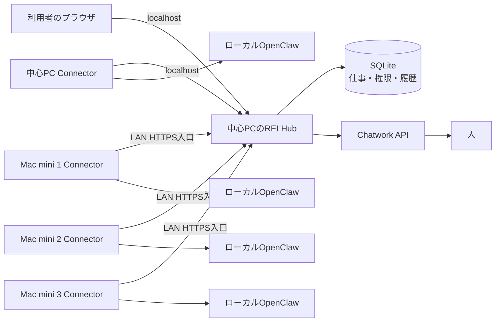
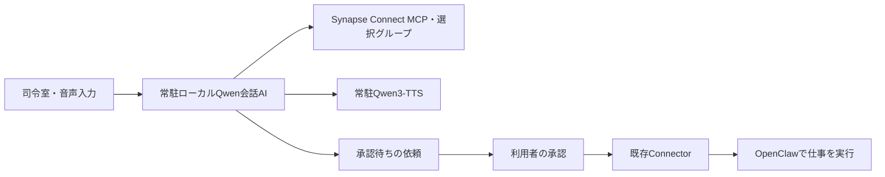
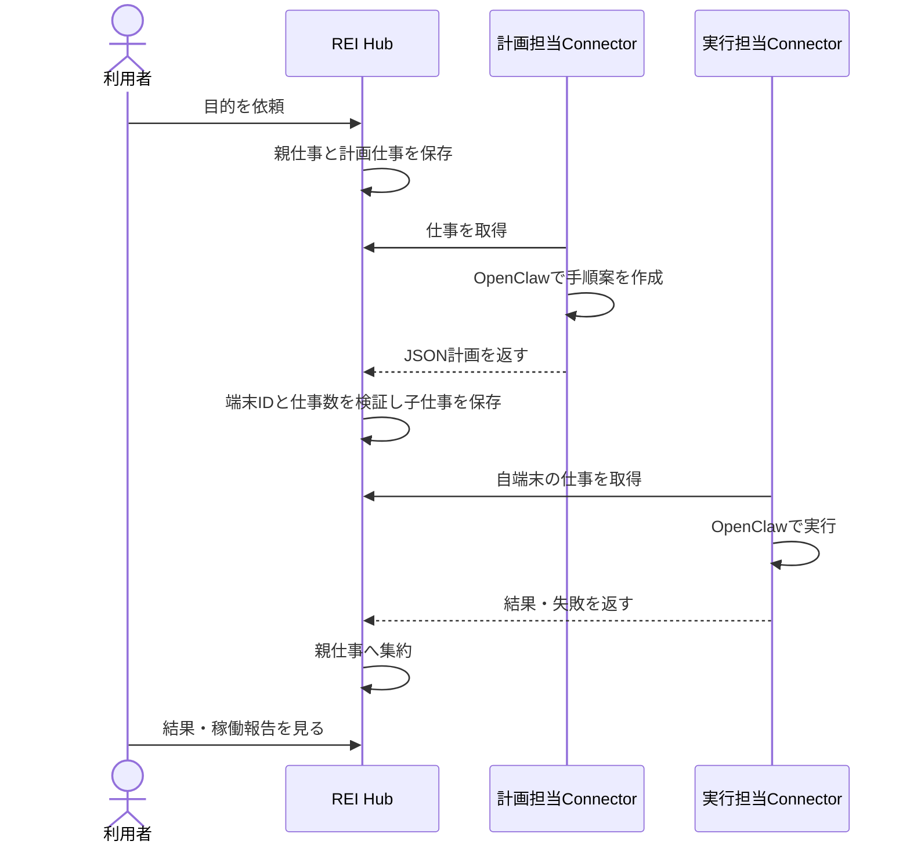

# REI ローカル版の設計図

## 暫定主張の保持と最新回答（2026-10-11 01:14）

暫定主張の確認と後半補足には、選択根拠/完全本文hash/棚の一致に加え、最新の根拠評価済み音声回答が最終JSONで有効な暫定全文をそのまま先頭に保持することが必要。主張変更・言い換え・並べ替えでは既存correctionで最新全文に置き換え、差分モデルは呼ばない。完全一致でも各主張の最新根拠評価・権限確認が必要で、文字一致だけを正確性の証明としない。同じ要点を保持した場合のみ確定後半を補足し、直前権限確認を取消とraceさせる。言い換えだけも訂正案内になる制約がある。旧差分モデル用の診断キーは互換性のためnull/0で残す。

## 暫定本文の重複取得照合（2026-10-11）

同一記録IDを最新取得中に複数回読む場合、本文hash/棚の不一致、削除・旧版・失効・不完全・エラーを一度でも含むIDはその会話の暫定本文一致判定から除外する。後の一致した本文で復活させない。同一完全本文の再読は許可し、無関係なIDの失敗は選択根拠へ波及させない。除外時は既存訂正経路へ進み、暫定要点を同じ本文で確認済みと通知しない。毎問最新取得・根拠評価・現行権限確認・最終JSON一致は維持。最新回答の全主張の正確性やスナップショット整合性の保証ではない。

## 2026-10-11 00:14 最新生成候補から検証完了までの診断

conversation-provisional.mjsはverifyの非空文字deltaを最初に受けた時刻をlatestDraftFirstMsへ、最終回答形式と現行権限の確認までの差をlatestDraftToVerificationMsへ記録する。双方request_start基準の数値/nullのみ。空・非文字・取消後・完了後deltaは対象外。生成候補であり最新確認済みの回答速度とは扱わない。暫定使用中は既存どおり最終本文指紋の照合と訂正/補足まで候補を配信しない。追加MCP/モデル呼出・本文の診断保存はない。

## 2026-10-10 23:14 明示会社の注意点を暫定候補へ

prefetchTopicQuestionは既存directCompanyOverviewSubjectが受け入れる会社名明示の「Xの注意点を教えて/ください」に限り元質問を返す。対象名は候補と原文位置の選択だけに使い、今回の質問全文で根拠を評価する。同一scopeの狭い詳細追加質問も前の注意点質問から話題を解決する。現行権限・完全本文・10分鮮度・部分範囲・時点付き暫定と毎問最新取得/訂正/補足のゲートは共通。一般知識/REI自身/代名詞/複合依頼は対象外。

## 2026-10-10 22:14 会話切断と保存履歴の回帰

tests/conversation-stream-api.mjsは既存の一時DB/架空workerで回答streamの切断後にbusyが解除され、次質問を受付し、取消質問を保存履歴へ含めないことを検証する。稼働アプリ変更なし。実機は会社概要の暫定配信途中取消→会社名を明示した別質問の毎問最新取得→正式完了→音声だけ停止を確認。取消前の未確定回答を履歴の根拠として使わない。

## 2026-10-10 21:44 入力会話の音声終了まで取消を保持

通常会話のaudio.finishを非同期のまま追跡し、speechPending中は文字配信finallyで中断ボタンを消さない。音声finishのfinallyは同じAbortController世代の場合だけボタンを消し、古い音声終了が新しい会話の操作を隠さない。意図したabort/OFF時の音声エラーは停止案内を上書きしない。調査中と文字完了後で案内を分け、完成済み履歴は保持する。OFF時は文字配信中以外で操作を消し、auth変更時は即座に無効化。既存Qwen/stream取消を利用。

## 2026-10-10 21:14 入力会話の取消境界

public/app.js の通常会話経路で command-interrupt を配信中だけ有効化。既存 AbortController と commandSpeech.cancel に接続し、入力・focusを維持する。中断後の delta/notice と abortを無視して解決した最終結果を適用せず、finallyでstreamingTurn・操作状態を戻す。送信disable中の再submitを抑止。既存サーバの切断取消を利用し、新しいMCP/モデル経路を追加しない。文字完了後の音声だけの再生は既存OFF操作、project/skillは対象外。

## 2026-10-10 20:44 話題全体を優先する先読み抜粋

spellingFallback有効の先読み抜粋は、単語へ分割する前に元の話題全体を最大100位置まで探す。原文一致がなければ既存の正規化位置検索、どちらもなければ従来の単語一致へ戻る。一般語の100件上限で本来の話題位置が押し出されることを防ぐ。一致は段落選択の手掛かりに限り、原文slice/4000字/省略表示とモデル評価・毎問最新確認を維持。通常の最新本文と日次抜粋は変更しない。

## 2026-10-10 20:13 先読みの表記ゆれと原文抜粋

明示概要・狭い詳細追加質問の長い先読み本文のみ、原文に話題の完全一致がない場合、NFKC/小文字/空白除去で段落位置を補助検索する。graphemeごとの原文UTF-16位置対応で全角・半角カナ・結合文字・合字の長さ変化を吸収し、モデルへ渡すexcerptsは原文sliceと元位置のまま。4000文字上限・omittedを維持。通常の最新回答本文と日次抜粋は従来処理。表記一致は候補位置であり同一実体や主張の証明ではない。元質問・完全本文ハッシュ・モデル評価・毎問最新権限/本文/訂正の条件を維持。

## 2026-10-10 19:43 先読み表示の周期更新

音声ON/画面visibleの既存bootstrapから30秒間隔で行うprefetch状態確認で、active=trueでも件数・取得時点・一部範囲・同期診断・利用可否の表示を更新する。取得時点は成功snapshotのcheckedAtだけ、状態確認の時刻へ書き換えない。同期中は質問可能を案内、失効/失敗は利用不可、状態通信失敗は確認不可を表示。追加のMCP取得/prepareは増やさず、非active時の既存再開のみ維持。auth epoch/音声OFF/準備世代（scope更新を含む）変更後の遅い応答は表示へ適用しない。画面の時点と毎問最新本文検証は別。

## 2026-10-10 19:13 詳細追加質問の履歴入力

readingSkill有効・現在の選択棚あり・directCompanyDetailSubjectで明示話題を解決した狭い詳細追加質問のみ、回答モデルへユーザー発言6件を保持し、過去AI回答は直前1件だけを渡す。直前の説明に続く内容とユーザーの好みは残す。未解決の質問は従来の全履歴、単独の明示概要は従来のAI回答なし。現在の根拠本文と参照ID評価・検索/権限・再検索・取消/訂正は変わらず、古い回答は根拠にしない。保存履歴自体を削除しない。

## 2026-10-10 18:43 狭い詳細追加質問の検索語

conversation.mjsのdirectCompanyDetailSubjectは「もっと詳しく教えて」等の狭い追加質問のみ、同一scopeのサーバー履歴直近6件の連続synapseRead=trueのユーザー質問から明示会社話題を検索語へ使う。一般会話/別話題/履歴不足/代名詞の会社名/複合指示は通常判断へ。過去のAI回答を検索語や根拠にしない。初回の検索語生成だけを省き、毎問の最新検索・現行権限・完全本文確認・回答評価・不足時再検索・取消/訂正は維持。元質問/履歴の好みは回答評価へ渡す。

音声パネルのconversation/prepareでは、ChatGPTの既存認証が更新時期ならtoken()の共有更新を待ってから準備完了にする。生成APIは呼ばず、認証情報を返さない。接続解除・モデル未選択・更新失敗・途中のアカウント切替は準備成功にしない。準備後に期限が近づけば通常の生成時更新も維持する。

単独の会社概要質問「Xについて教えて/知りたい/聞きたい」と、狭い注意点質問「Xの注意点を教えて/ください」は、会社情報取得が必要な明示語を持ち、REI自身の話題でなく、対象が2〜60字の一つの場合、対象をそのまま検索語にする。注意点の代名詞・汎用会社名・複数対象は通常判断へ戻し、元質問全文は回答評価へ渡す。注意点の暫定候補は23:14の限定条件に従う。surveyと権限を維持した範囲で新規MCP検索・本文読取を行い、その後の根拠評価/回答モデルは省かない。一般知識、曖昧な追加質問、REI状態、複数依頼はこの新規経路へ入れない。

暫定の配信前権限確認は、根拠ID・評価ヘッダと本文の文字が検証できた時点で始め、一文の生成と並行化する。文の断片は配信しない。確認完了から1秒を超えた場合は再確認し、拒否・失敗・取消・最新回答先着で暫定配信を抑止する。permissionChecksは暫定ゲートの回数、permissionMsはその所要時間合計、assessmentReadyMsとfirstSentenceMsは要求開始からの別々の時刻。最新確認後の権限確認は別に維持する。

暫定生成の診断は入力messagesのUTF-8バイト数、候補記録数、送信本文または抜粋の文字数、要求開始から最初のモデル文字までを数値だけ付ける。JSON評価項目の初文字を事実回答開始と扱わない。非配信時刻はnull。会社本文と出典IDを診断へ複製しない。

## 時点付き先読みの会話経路（2026-10-09）

ChatGPT Proの会話では、利用者・役割・連携・選択棚で分離した本文索引を使う。64本文・4MiB・10分の鮮度上限を保ち、今日の大量追加で昨日の本文がゼロにならないよう最大16枠を昨日へ予約する。保存範囲はlimitedで、全件取得済みとは扱わない。再起動時は期限内の保存索引の同期時刻を保持し、周期同期の開始は回答中を避ける。質問ごとの現行catalogとローカル範囲確認は別途実施する。

暫定モデルの評価フィールド・根拠IDが本文より先に届き、完成した最初の一文と現行権限を確認できた時点で一文を逐次配信する。残りの完成JSONは先に出した本文／IDと照合し、不一致や失敗した暫定を同じ本文ハッシュだけで確定しない。遅い権限確認が失敗済み生成を復活させない。

明示した概要／今日・昨日の追加質問に限り、最新converseと暫定要点生成を並行させる。日時・部分範囲を示して先に話し、最新回答へ置き換え、補足または明示的訂正をQwenで流す。索引不足・期限・権限・評価不成立では従来の逐次回答へ戻る。追加質問の先読み対象推定は未対応で、毎回の最新取得を維持する。履歴の事実本文は確定結果だけ。確認失敗した暫定は画面で未確認とし、次の根拠へ流用しない。

配信はprovisional/verified/supplement/correction/verification_failed/delta/doneを区別し、表示の確定本文と音声配信済み文を分ける。訂正は旧Qwen合成・再生を取り消して始める。意味的な補足は同じProで最新確認済み回答から生成し、使用IDを検証するが、IDの一致だけで意味の適合性や重複除去を保証しない。モデル評価と実機計測を継続する。

## 会話のSynapse読み取り手順

当日の追加を尋ねる質問は、語句検索ではなくget_updatesの台帳へ分岐する。日本時間の日付範囲でcreated_atを判定し、全選択棚を独立してページ送りする。advance=falseとサーバ発行cursorを使い、初回streamはランダムな名前で他セッションの栞と衝突させない。最大8ページ×1000件、本文は最大64件で6並列。重複はUUIDで除き、範囲・追加日時・coverageを検証する。位置と当日のIDだけをユーザー・連携・選択範囲・日付で分離してメモリに保持し、次回も差分と本文を新しく読む。追加件数と本文確認件数、追加日と出来事の日時、省略や取得不能を別々に示す。

個人の棚は所有者の会話用設定conversation-scope:<userId>に保存する。確認済みcatalogからだけ選択でき、会社共通のcompany_intelligenceや定期確認へ混ぜない。adminは所有者の個人設定を継承せず、個人棚の選択もできない。MCP由来の記録は外部source_refがなくても、保存者・記録ID・選択範囲・完全な保存本文を確認できれば記録として扱う。外部原本を検証したとは呼ばない。

progressはモデル出力ではなく実処理から生成する。固定の検索・本文確認・取りまとめ案内と、台帳で確認できた追加件数だけを別イベントで送る。案内は回答デルタ・会話履歴・最初の回答の速度に混ぜない。Qwenは案内を重ねて再生せず、最初の非空回答断片で案内再生を止める。認証済み利用者と音声要求UUIDを組にした取消を送り、音声片の境界で生成だけを終了し、元streamの取消確認まで待って同じworkerで回答を作る。取消受付だけでは次を開始せず、旧worker/取消通信失敗は生成を読み切る。全面中断はworker停止を維持する。固定案内の音声だけをメモリ内で再利用する。本文・会社の返答音声はそのキャッシュへ入れない。

現行の通常経路はrespond（根拠適合性と回答の一体生成）を使う。status/sourceIds/reason/queryをtextより先に受け取り、今回本文を確認した範囲のIDを検証してからtextだけを配信する。再検索が必要なpartialとinsufficientは配信しない。独立したassess→answerの二回推論は通常経路では使わない。ID検証は内容の正しさの保証ではなく、本文の適合性はモデル判断と継続した評価が必要。

Hubは認証済みの会話準備・履歴取得時に構造確認を開始する。ユーザーID・連携名・選択範囲をキーに最大32件のメモリ内状態を保持。構造だけ90秒以内で初回準備または同じ話題の追加質問へ再利用し、新しい話題・範囲変更・期限超過は再取得する。事実検索と本文読み取りは質問ごとに行う。準備失敗を回答成功と扱わず、各取得でも現在の検索範囲とアクセス不能を確認する。Qwen起動は読み取りと重ねる。文字開始・回答音声開始・全文完了・相槌・事前準備を別々に評価する。

適合性のstatusはsupported/partial/insufficient/ambiguous。判断フィールドは音声へ流さない。不足時は最大2回の検索範囲内で再検索し、未確認の現在情報は推測しない。人物の現在作業・作業ログ質問は人物検索とwork_log候補検索を併用し、既存選択範囲を維持する。候補件数上限、保存日時と作業日時の違いがあるため、候補内の最新を会社全体の最新版と呼ばない。長い本文は全文取得・検証後に質問付近と末尾を含む位置付き抜粋に変換し、抜粋にない内容の不存在を断定しない。

`load-synapse.mjs` は公式load-synapse 0.8.0の手順を会話用に適用する。会社検索は選択グループのsurvey_space → search_memory_facts → get_fact_source/本文確認で進む。空の事実検索、または現在・指定日の質問ではsearch_episodesも呼び、full_content_lookupの読み取り引数だけを採用してget_episodeで本文・範囲・完全性・出どころを確認する。全文候補にも本文取得を適用する。現在の質問は返された候補集合内の新しい保存日を優先するが、作業日と保存日を混同せず、候補集合全体の最新性は保証しない。group_unavailableは再試行せず、選択済みの利用可能グループだけで続行する。MCP呼び出しは既存認証の読み取り専用で、公開診断には本文・記録ID・グループID・認証を含めない。

```mermaid
flowchart LR
  U[利用者のブラウザ] -->|localhost| H[中心PCのREI Hub]
  H --> D[(SQLite<br/>仕事・権限・履歴)]
  H --> C[Chatwork API]
  A[中心PC Connector] -->|localhost| H
  B[Mac mini 1 Connector] -->|LAN HTTPS入口| H
  E[Mac mini 2 Connector] -->|LAN HTTPS入口| H
  F[Mac mini 3 Connector] -->|LAN HTTPS入口| H
  A --> OA[ローカルOpenClaw]
  B --> OB[ローカルOpenClaw]
  E --> OE[ローカルOpenClaw]
  F --> OF[ローカルOpenClaw]
  C --> P[人]
```

## 会話と仕事の分離（0.5.39）

```mermaid
flowchart LR
  UI[司令室・音声入力] --> CHAT[常駐ローカルQwen会話AI]
  CHAT --> MCP[Synapse Connect MCP・選択グループ]
  CHAT --> VOICE[常駐Qwen3-TTS]
  CHAT --> DRAFT[承認待ちの依頼]
  DRAFT --> APPROVAL[利用者の承認]
  APPROVAL --> CONNECTOR[既存Connector]
  CONNECTOR --> WORK[OpenClawで仕事を実行]
```

Hubの`conversation/ask`はConnectorのAIジョブを作らず、MLXの4bit会話モデルを常駐させて返答する。モデルはJSONで操作を提案し、サーバーが読み取りツール4種類・選択グループ・取得済みID・検索2回の上限を強制する。出典が追跡できない検索結果を確定情報として返さない。MCP認証と通信だけは同梱OpenClaw 2026.7.1の内部ランタイムを再利用するため、同バージョンに依存する。更新時は直接MCP接続の検証が必要。

会話履歴は既存SQLite設定へユーザー別に6往復保存する。クライアントから渡された履歴は権限や事実の根拠に使わない。検索範囲変更時は履歴を無効化し、通常の仕事一覧へ会社の回答を公開しない。会話担当からの仕事は必ず承認待ちにする。

生成は内部でトークン逐次処理するが、現在の画面と音声へは完成した回答を渡す。MCP検索、ローカル生成、音声合成の時間はそれぞれ残る。音声認識はブラウザの既存サービス。Qwen3-4B-Instruct-2507は最初の検証候補で、他の会話モデルとの比較による最終選定ではない。

## 役割

- **Hub:** 仕事の唯一の記録元。ログイン、権限、端末登録、割当、報告、Chatworkを管理する。既定は `127.0.0.1:4178` のみで待ち受ける。
- **Connector:** 各PCで常駐。端末専用トークンでHubへ接続し、仕事を取得して、そのPCのOpenClawへ渡す。初回のかんたん端末追加では、そのPCにREI用エージェントを作る。別PCへ直接接続は行わない。
- **OpenClaw:** 計画担当と実行担当。新しい参加PCでは専用の `rei` エージェントを作成する。既存の `main` が不要なら、作業場所と表示名をREI用に変更して使うこともできる。REI用エージェントに明示的なツールプロファイルがなければ `coding` を設定し、直接メッセージ送信とGateway管理ツールを無効にする。既存の明示的なプロファイルは保持する。
- **Chatwork:** 人へ渡す仕事の投稿・返信取得。APIトークンはHubのローカル暗号鍵で暗号化して保存。
  返信は仕事IDと投稿者アカウントを照合する。複数の異なる仕事IDが含まれる投稿、REI自身の投稿、投稿者不明のメッセージは回答としない。投稿IDが取得できない場合は送信結果不明として人の確認を待つ。

同一LAN内の端末接続には専用HTTPS入口を使う。入口はプライベートIPだけで待ち受け、端末用API以外を拒否し、管理画面とCookieを公開しない。中心PCは自己署名証明書を生成してアプリ外に保存し、接続URLに証明書のSHA-256指紋を含める。参加PCは証明書を照合してから接続コードや端末トークンを送信し、以後も同じ証明書を要求する。URLとコードは別々に渡す。別ネットワーク間のREI単体接続は未実装。

ZIP版の従来の遠隔接続はTailscale ServeのHTTPSルート `/` がこのHubのローカルポートへ向く場合だけ案内する。同じ入口にFunnelが有効なら公開接続として警告し、参加PC用URLを案内しない。既存の `/` ルートが別のサービスを指す場合も自動上書きしない。

## 仕事の流れ

```mermaid
sequenceDiagram
  actor U as 利用者
  participant H as REI Hub
  participant P as 計画担当Connector
  participant W as 実行担当Connector
  U->>H: 目的を依頼
  H->>H: 親仕事と計画仕事を保存
  P->>H: 仕事を取得
  P->>P: OpenClawで手順案を作成
  P-->>H: JSON計画を返す
  H->>H: 端末IDと仕事数を検証し子仕事を保存
  W->>H: 自端末の仕事を取得
  W->>W: OpenClawで実行
  W-->>H: 結果・失敗を返す
  H->>H: 親仕事へ集約
  U->>H: 結果・稼働報告を見る
```

## 接続と故障時の扱い

計画で分けた工程は複数PCで同時に開始し得る。計画担当には独立した工程だけを分け、順序が必要な作業は一つの工程にまとめるよう指示する。計画が存在しないPCを指定したり13工程以上を返した場合は実行せず「要確認」にする。
計画担当には登録端末のID・名前・OpenClawエージェント名・接続状態・機能を渡す。端末を指定する場合は接続中のPCを優先し、停止中のPCへ任せる工程には待機理由を含める。

1. Hubは端末登録時にランダムなトークンを一度だけ発行し、DBにはハッシュを保存する。
2. Connectorは空き時間に約15秒ごと、OpenClawでの仕事中は10秒ごとに心拍し、空き時間は約3秒ごとに仕事を取得する。
   MCP連携の設定・状態確認と明示的な接続検査は別処理で行い、確認先の応答が遅い間も10秒ごとに心拍する。設定確認の失敗後は同じ設定の再試行を約60秒あける。
3. 取得した仕事には4分の期限を設け、処理中は30秒ごとに更新する。
   OpenClawの1工程の実行期限は既定で30分、設定可能範囲は1分〜2時間。実行中もConnectorは心拍と取得期限の更新を続け、OpenClawの期限後も終了しないプロセスは停止させる。
4. 計画の取得期限が切れた場合は最大3回まで再試行する。実行仕事で結果が不明になった場合は自動再実行せず「要確認」にする。期限切れ工程、親仕事、履歴の更新は一括で保存する。
5. 端末トークンを解除するとその端末の新しい通信は拒否される。
6. Chatworkへの送信開始は仕事の状態と履歴を一括保存できた後だけ行う。投稿後のID・仕事の状態・履歴も一括保存し、結果が不明なら二重投稿を避けるため「要確認」にする。送信中にHubが落ちた場合も、再起動後に送信開始から60秒が経つと「要確認」に移す。
7. 計画担当PCの心拍が30秒以上途絶えた場合、計画機能のある接続中の別PCが新しい計画を引き継ぐ。実行中の仕事は自動再実行しない。
8. OpenClawのCLIが正常終了しても、返答の処理状態が失敗または中断なら完了扱いにしない。ツール失敗の明示的な返答も「要確認」に送る。
9. 結果保存後に応答だけが失われた場合、同じ端末・取得期限ID・結果の再送は保存済みとして応答し、履歴を重複作成しない。実行工程が期限切れで「要確認」になった後に元の端末から結果が届いた場合、報告を別に保存し、自動で完了にはせず人が実施状況を確認する。人が先に確認を終えた場合も、遅れて届いた報告を保存して仕事を再び「要確認」にする。
10. ConnectorはHubが結果を受理したと確認できるまで、`pending-results.json` の送信待ち結果を消さず、次の仕事も取得しない。Hubが照合を拒否した場合は記録を保持して再試行し、心拍で送信待ち件数をHubへ知らせる。司令室と端末設定画面で件数を表示する。
11. 送信待ち結果が壊れている、または保存途中の `.tmp` が残っている場合、Connectorは起動を止めてファイルを保持する。保存に失敗した場合も仕事を続けず停止する。
12. 実行中のPCを解除したときは、そのPCが持つ仕事の期限を直ちに切らす。計画は再試行可能なら別PCへ戻し、実行工程は二重実行を防ぐため「要確認」にする。
13. Hubと同じREI版を報告していないConnectorは、版番号がない古い端末も含めて新しい仕事を取得できない。心拍と実行結果の返送は受け付け、更新が必要なことを端末画面とログに表示する。

## データと権限

SQLiteはWALモード。プロジェクト、仕事、子仕事、端末、利用者、イベントを持つ。データ形式の版をSQLiteに記録し、現在のREIより新しい形式なら変更せず起動を止める。プロジェクトの目的は計画担当と実行担当のOpenClawへ渡す。ブラウザにはHttpOnly・SameSite=StrictのセッションCookieを使う。所有者/管理者はプロジェクトを作成・変更し、仕事を直接依頼できる。依頼者の仕事は承認後に実行し、閲覧者は参照のみ。HubのREST APIが権限を検査する。
終了したルート仕事の所属変更は所有者・管理者に限定する。ルートと子工程の `project_id` を一つのトランザクションで更新し、元と先のプロジェクト更新時刻および監査イベントを記録する。進行中・結果確認待ちの仕事は変更しない。

プロジェクトの共有メモは認証済みユーザーの要求時に生成する。件数は全ルート仕事から集計し、本文はそのプロジェクトの新しい20件を直接取得する。プロジェクト画面の最近の仕事も同じ案件別の取得結果を使い、全体の最新100件からの抽出に依存しない。残り件数を返して省略を明示し、ブラウザの明示的な操作でクリップボードにコピーする。自動送信はしない。
案件の仕事検索は認証済み利用者だけが使える。プロジェクトIDで絞った全ルート仕事の依頼・結果・失敗内容を照合し、最新50件と残件数を返す。結果から個別の仕事の詳細を開ける。
日次の稼働報告では仕事と所属プロジェクトを結合し、当日分と前日以前から残る要確認の仕事へ案件名を添える。単発の仕事はUIとコピー文面で「単発」と示す。当日分の承認待ちは別の件数として返し、要対応表示に含める。当日の各仕事から詳細画面へ移動できる。
前日以前に作成された `approval_pending` のルート仕事は本日の件数へ混ぜず、件数と新しい10件を承認待ちの別枠へ表示する。詳細へ移動でき、コピーした報告にも含める。

共有ナレッジは `project_notes` に保存し、作成者と作成日時を保持する。所有者・管理者・依頼者が追記でき、閲覧者も参照できる。既存記録を上書きする操作は用意せず、プロジェクト画面には最新50件、共有用進捗メモには最新5件を表示する。検索APIはプロジェクトIDで絞った全履歴から件名・本文・作成者を照合し、最大50件と残件数を返す。データ形式は版2へ移行し、旧版REIによる読み込みを拒否する。
完了したプロジェクトの仕事は、結果をそのプロジェクトの共有ナレッジ入力欄へ下書きとして転記できる。保存は利用者の明示操作と既存の作成APIで行う。入力欄の上限を超える結果は先頭4000文字に切り、切り詰めたことを表示する。

社内スキルは既存の `playbooks` にセクションと参考知識を追加して保存する。認証済み利用者の検索は名前・用途・依頼文・参考知識・作成者を対象とし、新着100件の一覧に入らない古い記録も検索できる。旧手順は全セクション向けとして保持する。利用者がスキルを選ぶと依頼文を編集でき、送信後に `tasks.skill_id` でルート仕事と計画仕事へ記録する。同じセクションの実行仕事へ継承し、Connectorの計画・実行プロンプトへスキルの内容を渡す。異なるセクションの仕事には継承しない。既存の依頼権限と承認フローを通す。マーケットプレイス検索はOpenClaw CLIの候補表示のみで、導入・実行は行わない。データ形式は版4。
完了したルート仕事から共有手順を作る操作はブラウザ内の下書き転記だけとし、サーバーへの保存は利用者が用途と依頼文を確認して共有手順フォームを送信したときだけ行う。
プロジェクトの共有ナレッジから共有手順を作る場合も同じ下書き方式とし、用途は空欄で人に入力を求める。閲覧者には作成操作を表示しない。

Connectorへプロジェクトの仕事を渡す際、Hubは目的と一緒に最新5件の共有ナレッジ（本文は各1000文字まで）と最近5件の終結した仕事（結果要点は各300文字まで）を添える。Connectorはそれらを参考資料と明示して計画・実行の指示文に含める。資料内の命令は独立した依頼として扱わない。

この権限は**Hubへの依頼権限**であり、OpenClawが持つOS上の権限を細かく制限するものではない。専用エージェントでも、許可されたツールからOSのファイルを操作できる。顧客配布時は端末ごとにOpenClawのツール権限と実行ディレクトリを個別に設定する。

## 配布形態

依存パッケージを必要としないNode.jsアプリ。GitHubにはソース、導入手順、テストだけを載せる。`data/`、Chatworkトークン、端末トークン、仕事履歴は `.gitignore` で除外する。新規利用者は自分のPCでHubを起動し、初回登録から始められる。

macOSはLaunchAgent、Windowsはスタートアップ登録、LinuxはsystemdユーザーサービスでHubとConnectorを自動起動できる。各OSの設定は利用者自身のアカウント内に保存する。
バックアップ先は既定の `data/backups/` に加え、Hubの `REI_BACKUP_DIR` で絶対パスを指定できる。手動・日次バックアップはHubの保存先を使い、自動起動設定にも指定を保存する。中心PCの診断を手動実行するときは同じ環境変数を渡す。外部保存先が使えないときは既定の場所へ自動で切り替えない。

## SynapseConnectを中核にした会社情報

`knowledge_mode`（work/answer/scan/catalog）、検索時点の`knowledge_scope`、検証後の`knowledge_report`をtasksへ追加し、データ形式を版5にした。既存仕事はworkとして保持する。会社情報の依頼はrootと単一のexecute工程を作成し、SynapseConnect登録済み・同一版・接続中の実行端末へ割り当てる。計画・人への依頼を生成しない。

catalogは組織共有と確認できるグループのID・名前だけを取得する。所有者は取得済みの候補から検索範囲を選び、設定を保存する。answer/scanの依頼ごとに選択範囲をスナップショットとして保存する。出典のgroupIdが選択範囲内か、記録IDが一意か、記録日時が解釈できるか、提案のsourceIdsが出典へ結び付くかを検査する。根拠のない肯定回答・提案、認証情報を含み得るURLは受理しない。recordIdが実ツール応答由来であること自体は検証できず、担当AIの検索に依存する。検索・回答・提案だけを行う方針もプロンプトで適用する。

回答全文と構造化された出典・未確認範囲・提案をrootへ保持し、通常の結果集約による1000文字への短縮を行わない。結果再送は正規化した報告でも照合し、応答消失後に同じ結果を重複処理しない。会社情報は所有者・管理者専用のAPIと画面で参照する。通常のbootstrap・仕事一覧・履歴・日次報告に会社情報の回答を含めず、詳細・イベントAPIも権限を確認する。仕事のプロジェクトへ所属変更する操作はworkだけを対象にする。

定期確認はsettingsに所有者・共有範囲・間隔・次回時刻を保持し、30秒のHubループで期限を判定する。端末・有効な所有者・設定した範囲が揃う時だけscanを作成する。同種の進行中工程がある場合は追加しない。設定保存の途中で中断しても、直近のscanの作成時刻が次の間隔まで重複を防ぐ。停止設定は新しい確認を止め、開始済みの確認は保存を終える。

## 音声会話

public/voice.jsは聞き取り・調査中・読み上げ・待機・エラーの状態を管理する。SpeechRecognitionの確定結果を認識終了後に1度だけ送り、回答の読み上げを短い区切りで行い、読み上げ終了後に次の聞き取りを開始する。読み上げ中は認識を停止して音声の自己再入力を避ける。割り込みボタンは読み上げを中断して聞き取りへ戻す。回答待ちには180秒の上限を設け、20秒後に検索中の案内を表示する。停止では待機の通信とタイマーを中断し、古い処理のfinallyが新しい会話のタイマーを解除しないよう各往復でタイマーを保持する。会話の世代番号で古いイベントや終了後の回答を無効にし、停止・ログアウト・画面離脱で認識、読み上げ、結果の待機を停止する。

会社への質問APIは最大3往復のquestion/answerを受け取り、長さと形式を検査する。tasks.knowledge_contextへ参考会話を保存し、以前の回答を根拠として扱わず再検索する指示を付ける。knowledge_voiceで音声用の短い回答と小さい検索範囲を指定し、OpenClawはlowの思考設定を使う。形式変更に伴いデータ形式を版6へ更新した。音声データはHubに送信しない。音声を扱うサービスはブラウザが提供する。音声を直接処理するRealtime APIは使っていない。

会社情報の工程はOpenClaw agent --localを使う。GatewayへのRPC待ちを避け、同梱版でも現在の担当AIのモデル・認証設定を使って実行する。会社情報はlowの思考設定で実行し、台帳90秒、音声150秒、文章・スキャン240秒で終了させる。版と選択した制限時間、処理時間をログに残す。結果はGateway形式（result.payloads）とローカル形式（payloads）の両方を読み、どちらもabortedを拒否する。通常の仕事の実行経路は従来のものを維持する。

Macの常駐処理はmacos-runtime.mjsで同梱Node.jsを保存領域のruntimeへコピーして使う。SHA-256で同梱元と照合し、不一致・リンク・不正な保存先を上書きしない。アプリ内の実行ファイルを常駐させた場合にOpenClawが停止する環境で、アプリ外の同一バイナリによる実行を確認した。起動時の修復判定も保存した実行環境を参照する。

## 自然な音声会話（GPT-Live）

方式を選んだ場合だけpublic/live-voice.jsがWebRTCでマイクと遠隔の音声を扱う。Hubのlive-voice.mjsが認証済み所有者・管理者のSDPをOpenAIの/v1/live/sessionsへ渡す。モデルはgpt-live-1、store:false、delegation.type:client。APIキーはAES-256-GCMと保存領域のvoice.keyで暗号化し、所有者だけが変更できる。キーはブラウザ・ログに返さない。providerのセッションIDはHubに保持し、利用者本人の終了要求と5分タイマーでhangupを要求する。接続失敗・キー不正では標準の読み上げに勝手に切り替えず、明示的な状態を表示する。

session.input_transcript.delta/output_transcript.deltaを原文のまま字幕へ足し、時刻情報と限定した会話文脈を保持する。session.delegation.createdを受けたときだけ既存の会社情報APIへ質問し、確定した回答と未確認をsession.commentary.appendで返す。送信済みの会社情報の質問・出典はHubに保存される。雑談の字幕はこの画面のメモリーに表示し、REIは音声そのものを保存しない。アクセス制約と読み取り方針は検索担当の既存処理に適用する。音声モデル自身の事実の断定防止は指示であり、全文の音声生成前の検閲は行っていない。APIキーなしでの模擬試験のみ実施済みで、実際の接続・日本語音声品質・割り込み・遅い転記の話題追従は利用者の認証後に実機確認が必要。

## ローカル音声（0.5.38）

司令室 → 既存の会社情報検索 → voice/local/speak → LocalVoice → 常駐Python/MLX Qwen → WAV → 再生。認証・同一送信元検査、所有者/管理者限定、500文字上限、1生成ずつ、120秒の期限、切断時の停止を適用。音声認識と検索担当AIは既存の構成を使用する。

開発配置はREI_LOCAL_VOICE_PYTHONとREI_LOCAL_VOICE_MODEL。リクエストから実行ファイルやモデルを変更できない。package-local-voice.mjsでPythonの標準ライブラリと音声依存だけを移し、同梱モデルのオフライン生成を確認した。設定がなければResources/local-voiceを使用する。依存ライセンス通知、別機種での確認、ピークメモリ計測は未完了。試用モデルはQwen3-TTS-12Hz-1.7B-CustomVoice-8bit（Apache-2.0）、mlx-audio（MIT）。

## Cowork実行先（2026-10-08）

Owner/Adminが承認待ちのrootをCoworkに渡すと、唯一のblocked planをexecuteへ変更し`cowork_waiting`にします。OpenClawのclaimは`ready`のみを取得するため二重配信されません。ローカルstdio MCPは承認済みキューに限定したlist/claim/reportの3操作を公開します。claimはSQLite transactionで`cowork_running`とランダムな受け取り証を記録します。reportは同じ受け取り証と状態を検証し`needs_review`へ戻します。完了はREIの既存reconcileで人が確認します。依頼の中止、重複報告、別実行先の隔離をテストします。

プラグインは同梱NodeとREIのcowork-mcp.mjsを起動し、このMacのREI SQLiteに接続します。認証情報をプラグインへコピーせず、HTTP公開や課金APIを追加しません。ローカルMCPはホストPC上の信頼したプログラムであり、Claude側の明示的なプラグイン導入・許可が必要です。WebだけのCoworkやローカルMCP禁止の組織には適用しません。CoworkからREIを取得する方向の連携で、REIがCoworkを自動起動するAPIは実装していません。

## ChatGPT Pro接続（2026-10-08）

REIの設定に「ChatGPTで会話」を追加。公式Sign in with ChatGPTの動的登録・PKCE・ループバックコールバックで、利用者ごとに接続する。対象Plus/Proの利用枠に対応し、APIキーへの切替や有料APIへのフォールバックは行わない。利用可否は実際のアカウントとアプリ登録で確認が必要。商用販売向けの利用は別途OpenAI側の提供条件を確認する。

会話コントローラーとSynapse Connectの原記録確認、作業の承認待ち作成は維持。会話の推論だけを選択したアカウントのResponses APIへ切り替え、声はローカルQwenを使う。store:false、stream:trueを必須とし、response.completedまで確認する。GPT-Liveの音声モデルへ切り替える機能ではない。

署名・issuer・audience・nonce・有効期限・本人一致・利用枠スコープを検証する。資格情報はデータ領域のchatgpt/<利用者IDのハッシュ>/account.jsonへ0600で保存し、UI・SQLite・ログ・Gitには出さない。通常バックアップの対象外のため、復元時には再ログインが必要。発行済みclient IDと端末IDを再利用し、更新トークンの更新は直列化する。別アカウントを追加・選択・切断できる。

追加費用を避けるため、利用者はChatGPT設定のUsageからREIのクレジット使用をOFFにする。現行の公式HTTP仕様にはクレジット使用をアプリから禁止するパラメータがないため、REI単独ではその設定を保証できない。実ログイン・クレジットOFF確認・Proの推論・Synapse経由の回答確認は未完了。秘密情報を使わない模擬テストでPKCE、state、署名、保管権限、更新競合、モデル選択、失敗ストリーム、切断を確認済み。

公式資料: https://developers.openai.com/siwc/token-sharing-open-source/sign-in 、 https://developers.openai.com/siwc/token-sharing-open-source/models-and-inference

## 生成途中の回答と音声（2026-10-08）

ChatGPTの回答デルタから、answerの本文だけを取り出す。会社の質問は今回のSynapse Connect検索と本文確認が済むまでデルタを出さない。Hubのconversation/streamは認証・役割・検索範囲を検証し、delta/done/errorをNDJSONで送る。Responsesの完了イベントと最終JSONが有効な場合だけ履歴を保存する。

ブラウザはデルタを表示し、句点または120文字でQwenの音声生成を順に開始する。音声生成列と再生列を分け、次の音声生成を現在の再生と重ねる。停止・切断・失敗時はAbortSignalで両方を止める。音声会話は全文と全音声の完了後に次の聞き取りへ戻る。音声は生成片ごとにWAVとして逐次送信する。ローカル会話モデルの本文は同じ経路で完成結果を送る。

音声応答をONにすると、既存のvoice/local/prepareでQwenを事前起動する。起動中の処理はLocalVoice.startの共有Promiseで一本化する。先頭音声の準備待ち・モデル生成開始・一文の生成完了を数値だけで返し、ブラウザの再生開始とは区別する。音声本文やWAVは診断属性へ書かない。

Qwen workerのstreamフラグは生成片ごとにchunk（連番・WAV・レート・秒数）、最後にdoneを返す。voice/local/streamは既存音声APIと同じ認証境界でNDJSON配信する。LocalVoiceの同時実行制限と停止処理を共有する。ブラウザは生成片のWAVを順に復号し、共有AudioContextの同じ時間軸へ予約する。全文生成を待たず再生し、文間でも生成処理を直列化する。音声ON・会話開始の操作でAudioContextを起動し、停止時は取得と予約音声を中断する。音声開始の計測値はrunning状態のAudioContext上の先頭予約時刻に基づくブラウザ推定で、物理的な出音の実測ではない。

会話の工程計測はリクエスト内の数値のみ。ChatGPTでは認証準備、応答ヘッダー受信、ストリーム先頭デルタ、完了を分け、会話コントローラーは推論と各MCP呼び出しの開始・所要時間を返す。並行するMCPの時間は合計せず時間軸として扱う。質問・根拠本文・モデル出力・認証情報を計測へ含めず、ディスクやログへ自動保存しない。司令室の診断属性には今回の工程だけを保持する。

出典のtraceableフラグだけでは本文確認済みにしない。選択グループ内の本文が返らない場合は、出典のepisode_uuidから同じグループの保存本文を取得する。保存本文は正しいIDとグループ、coverage.complete、非省略の本文、記録日時とsource_refを確認する。原本へのリンクがあっても保存本文だけを読んだ場合は、外部原本や現在の状態が未照合であることを回答に残す。

現在・指定日の検索では事実検索と原文候補検索のcoverageを確認し、利用可能範囲を確定してからget_episodeとget_fact_sourceを並行取得する。取得完了後は従来の順に検証済み根拠を回答へ渡す。同じ質問内の本文取得キャッシュを共用し、次の質問ではMCPから再取得する。

広い会社グループの概要質問は、早期受け答えと同じ限定パターンで初回の会社検索判定を行い、survey前の使われないモデル判断を避ける。根拠を確認するまで回答ストリームを開かない。失敗時も固定の失敗区分と数値の工程計測だけを返し、元の例外・本文・認証情報は診断へ含めない。

利用者が明示した対象名での定型概要質問は、初回survey後にその対象名で直接search_memory_factsを呼ぶ。検索語のためだけにモデルを呼ばず、従来の候補・出典・本文検証を通してから回答を生成する。本文不足時の追加検索と閲覧不能時の停止は維持する。

会話MCPの接続準備は同時呼び出し間で共有し、初期化中の終了は準備完了を待つ。初期化失敗後は再試行可能。グループ別surveyの並行化は実会話で改善未確認のため採用せず、一括取得を維持する（2026-10-08）。
# Daily retrieval concurrency (2026-10-09)

Daily additions use concurrent read-only scope survey and ledger retrieval. Both must finish successfully before any body is used; ledger rows are filtered to the surveyed scope. Failure drains both operations and cannot release a model answer. Full bodies use a bounded six-worker pool that refills immediately when each read completes, preserving ledger order for evidence review and waiting for in-flight reads on cancellation/failure. No body cache or expanded permissions are introduced.

## 2026-10-09: 会話用本文先読みの基盤

conversation-prefetch.mjsは利用者・役割・連携・選択棚で分離した本文コピーを既存SQLiteへ保存する。差分ストリームと保持本文の再取得を5分間隔で行い、前後のcatalog、完全性、期限を検証する。64件を超える本文の範囲はlimitedであり、先読みが会社全体を網羅すると保証しない。失敗・失効時は旧コピーを使用不能とする。状態APIに本文や原記録IDを出さない。

19:34以降はHub・画面・Qwenへ暫定／最新確認／補足／訂正を統合済み。利用対象は限定された概要・日次追加質問で、追加質問の先読みは未対応。設計はPREFETCH_CONVERSATION_DESIGN.md、実測と留保はIMPLEMENTATION_STATUS.mdを参照。

## 暫定のモデル形式と時計

最新本文が揃った回答生成時に、その要求で完成・検証済みの暫定文を比較対象として読み取る。暫定の出典IDが今回の本文確認範囲にある場合だけ、JSON参照資料としてモデルへ渡す。最新本文で全主張が支持される場合は同じ要点から完全回答を作り、REIが先頭の完全一致を除いて残りを補足する。古い主張を保存する義務はなく、変更・不足・矛盾なら最新根拠を優先する。今回選択した出典・本文ハッシュ・権限の既存ガードは維持し、一致しなければ訂正または保守的な補足生成に戻る。別の補足モデルを省けるのは、この条件が実際に成立した場合だけ（2026-10-09 21:43）。

暫定生成と確認済み補足はrespond専用JSONでreason/queryを空に制約し、通常の作業判断形式とは分離する。累積デルタの最初の完成文と根拠IDを検証後、現行権限の確認を行う。補足の完成結果が先頭・IDと違う場合は確認済み全文へ明示的に戻す。終了後の権限応答では遅い一文を流さず、中断はモデルの完了を待たない。要求起点のfirstSentenceMs、permissionStartedMs、modelCompletedMs、supplementFirstSentenceMs／supplementFirstMsと、所要permissionMs、数値だけのprovisionalTransportを返す。応答ヘッダーはモデル要求起点、streamFirstDeltaMs／streamCompleteMsはヘッダー受信後のストリーム起点なので、そのまま同一起点として比較しない。本文や任意providerメタデータは診断に含めない。

## 案内の再生停止と生成の継続（2026-10-09 22:13）

ローカル音声ストリームは生成と再生の中断信号を分ける。回答テキストが届いた時点で受け答え・調査案内をstopPlaybackし、予約済み音源を停止、後着チャンクを無音で排出する。案内の生成は最後まで読み、完了後に回答を直列生成する。HTTP生成要求をAbortするとQwenワーカーが閉じるため、回答のための案内停止では生成要求をAbortしない。利用者による全体中断は両方を停止する。案内と回答の開始時計は引き続き別に扱う。

## 日次追加本文の取得枠（2026-10-09 22:43）

日次の追加履歴から選ぶ最大64本文は12枠で取得し、空いた枠から補充する。全本文の取得・検証後に回答を生成する障壁は維持。失敗・中断時は実行中要求を終了させ、次の会話へ孤立した要求を残さない。先読み同期は6枠のままで、全用途を一括拡大しない。サーバー負荷は未計測のため、エラー・遅延増なら元の6枠へ戻して比較する。
## 実行中の権限一覧要求（2026-10-09 23:13）

catalogは認証runtimeをWeakMapのキーとし、連携名ごとに未完了Promiseだけを共有する。完了・失敗で削除し、次の確認は新しいlist_groupsを呼ぶ。各呼出元へstructuredCloneで独立結果を渡す。別連携・認証runtime置換を跨ぐ再利用はしない。権限一覧のTTLキャッシュや確認省略ではない。

## 権限一覧の待ち時間の診断（2026-10-09 23:43）

catalogは呼出元ごとにconnectMs（runtime準備）、waitMs（準備後から結果まで）、totalMs、joined（実行中要求への合流）だけを付ける。合流後の待ち時間は元のRPC全時間ではない。Hubは暫定経路のsnapshot/permission別にcatalogChecksとして回答の数値診断へ渡す。連携名・利用者・棚ID・本文・認証・要求内容は含めない。失敗時の値は返さず、欠落を0と解釈しない。

### 日次暫定回答の時計（2026-10-10）

質問開始時刻を先読み本文の追加日選択・生成指示の日付へ渡し、snapshot待ちで日付を越えても対象日を変えない。鮮度期限と権限確認は処理時点の現在時刻で判定し、古い権限や本文を延命しない。

### 限定した詳細追加質問（2026-10-10 00:43）

同じ利用者・選択範囲のサーバー履歴のユーザー指定話題だけを先読み候補の照合に用いる。明示的な「○○について教えて」から最大6ターンの詳細質問の連鎖だけを扱い、未取得履歴・別話題・曖昧な日次質問は推測しない。過去AI回答は暫定入力に含めず、モデルは今回選んだ本文を根拠として査定する。最新MCP取得・現行権限・鮮度・訂正は各質問で維持。

### 候補照合の表記差（2026-10-10 01:13）

先読み候補の照合ではNFKC・小文字化・空白除去を使い、2文字未満の対象を除外する。これは候補選択だけで、同一主体や事実の証明ではない。モデルへ元の質問/本文/出典を渡して査定し、最新MCP確認・権限・鮮度と訂正経路を維持する。

### 最新根拠回答の生成診断（2026-10-10 06:13）

Hubの質問ごとの配列evidenceModelChecksへ、evidence_answer生成の入力UTF-8バイト数、モデル呼出全時間、最初のdelta（JSON評価情報の場合があり回答開始ではない）までの時間と、認証・headers・streamの既知数値だけを返す。先読み/検索計画/補足は対象外。会社本文・プロンプト・根拠ID・任意のprovider情報は含めず、非有限値/負値を除外し、未計測のdeltaはnull。複数回の根拠評価は順に別要素、失敗は成功測定として追加せず既存例外を維持する。時間は重なるので加算しない。

### 明示会社概要の履歴入力（2026-10-10 06:43）

選択棚と検索スキルが有効な単独の明示会社概要では過去AI回答だけを外し、ユーザー発言と今回取得した本文を保持する。相対対象、会社名を示さない質問、追加質問、一般知識では全履歴を維持。先読み生成/最新取得/権限/根拠評価は不変。

### 取得本文の状態確認（2026-10-10 07:13）

検索後の本文取得でもinvalid_at、deleted=true、is_latest_revision=falseが明示された場合は根拠として採用しない。get_fact_sourceのルート・各source・get_episodeのepisodeとルートを確認し、無効な兄弟本文はモデル入力へ渡さない。有効な兄弟本文だけは保持する。状態項目が無い場合に最新版を証明するものではなく、外部原本の照合やサーバが返さない削除状態は未保証。

### 先読み本文の応答全体の状態確認（2026-10-10 07:43）

get_episodeのepisode内だけでなく、応答ルートのdeleted=true、is_latest_revision=false、invalid_atも拒否する。同期失敗扱いとして旧コピーを削除し暫定経路を無効にする。状態項目の欠落から最新版を証明するものではない。

### 訂正後の音声通知（2026-10-10 08:13）

createConversationSpeechは本回答の世代を管理し、訂正restartと全取消で世代を進めてから古い音声を取消する。旧世代のonPlaying/onPrepared通知は同期でも遅着でも現在回答の計測に渡さない。現世代の通知は維持する。

### 文字入力の音声ONの準備（2026-10-10 08:43）

音声応答ON時は既存Qwen準備と並行して認証済みconversation/prepareを呼ぶ。既存ChatGPTトークン更新と会話索引準備を開始し、推論呼出は増やさない。準備完了を送信条件にせず、通常経路の権限・最新確認を維持する。

## 先読み本文取得の診断（2026-10-10）

同期の数値診断は本文要求の開始件数・呼出側の最大同時実行数・所要時間の合計/最大と、既存MCP計測の接続/要求時間の合計・計測済み件数を持つ。合計は並列の重なりを含み、実時間とは異なる。要求時間は同梱runtime.callToolの待ち全体であり、純粋な通信時間やサーバ実行時間に分解できたことを意味しない。同時実行数も呼出側の観測で、サーバ側の並列実行の証拠ではない。本文・出典ID・棚ID・認証・エラー原文は含めず、SQLiteへ診断は保存しない。要求6並列と毎回本文取得・前後権限確認を維持する。

### 会話へ先読み通信を譲る（2026-10-10 13:13）

HubのconversationBusyをprefetch IOへ渡し、同期中もcatalog/本文の各次要求/最終catalog前で100ms間隔のabort可能待機。発行済み6要求は完了し、空いた枠への再投入は会話終了後。yieldMsは各待機の合計で並列分が重なり壁時計とは異なる。prepareの背景開始もbusy中は抑制し、質問の最新MCP経路を維持する。

### 挨拶と短さ指定（2026-10-10 13:43）

即時social経路は挨拶と「短く/一言で」+「返事/回答/答え」+「して/してください」だけを全文一致で許可し、短い挨拶を返す。会社事実を含む混合文や文脈依存の「短くして」はここへ入れず毎問の最新根拠経路を維持する。

### ON画面のQwen再準備（2026-10-10 14:13）

bootstrap成功後の非同期状態確認は音声ONのみ。未ready/未busy/設定済みなら既存prepareを呼び、未完了の再確認は重複しない。状態取得後の音声OFF/認証epoch変更を再確認し、質問送信は待たせない。起動時間を質問前へ移すため、質問後の測定と準備全体は別に扱う。

### ON画面の先読み復帰（2026-10-10 14:43）

先読み状態は現在のHubで当該scopeを周期同期対象として保持するactiveを返す。bootstrap成功後、音声ONの画面は30秒間隔上限で状態を確認し、active=falseなら既存conversation/prepareと準備追跡を再開。保存済み本文がreadyでも再起動で周期同期対象から外れた場合は復帰する。未完了処理は重複せず、状態取得後に音声OFF/認証epochを確認。質問を待たせず、8棚選択・権限/鮮度/削除/改訂検証・毎問最新取得を維持。

### 暫定評価ヘッダーと権限確認の並行化（2026-10-10 15:13）

生成ストリームのrespond/status/sourceIds/reason/query評価が完了しtext文字列の開始を受信した時点で、本文が空でも許可済みsource ID・supported/partial・query空・重複なしを確認して権限再照合を開始する。本文自体の採用は従来のreviewedAnswerPrefixと完全な最初の一文、直近1秒の権限、現在scope/鮮度/取消/最終評価一致を必要とする。権限単独では発話しない。評価不正は照合を開始しない。遅い文章では権限を再更新する。

### 暫定音声の参照時点（2026-10-10 15:43）

最初のspeechTextにAsia/Tokyoの月日・時分と「一部の記録による暫定ですが、」を要点の前へ付ける。早期一文にも含め、後続tailは時点を繰り返さない。UI/最新確認/権限/鮮度/訂正条件は維持。firstAudioMsは説明を含む音声の再生開始推定であり、物理出音や要点の聴覚時刻ではない。

### 暫定抜粋の話題語（2026-10-10 16:13）

長文本文のevidenceBodyContextへ渡す検索語は、既存の明示話題/詳細追加質問から解決したtopicRequestの話題名だけを使う。モデルのquestion/topicQuestionは元のまま、日次は元質問を使う。候補選定・上限4000・抜粋原文位置/omitted・根拠ハッシュ/権限/最新確認は維持。候補の表記ゆれ一致は抜粋全文の正規化を意味しない。根拠を拾うことで送信文字数が増える場合があり、速度効果とは分けて扱う。

### Hub起動時の保存scope復帰（2026-10-10 16:43）

server.listen後、明示保存conversation-scopeを持つ有効owner/adminを最大16人調べ、prefetchContextの現在scopeに対応するローカルsnapshotがusableの場合だけ既存outline/prefetch準備を再開する。期限切れ・未設定は従来の画面準備/最新取得、保存破損は利用者単位で隔離。同期登録や接続準備は非同期で、質問ごとの新鮮catalog/本文/権限確認を省かない。速度効果は準備時間と質問後遅延を分けて測る。
## 2026-10-10 17:13 補足発話の権限ゲート

verification_supplementは有効なsupported/根拠ID/空queryヘッダーから権限照合を開始。発話には完全な一文と直近1秒の許可が必要。古い許可は再照合する。終了解析・不正最終形訂正・中断隔離を維持し、最新全文だけを正式履歴とする。診断に評価/権限開始/所要時間/回数の数値のみ追加。実機2回は暫定insufficientで補足経路未使用、実速度効果未検証。
## 2026-10-10 17:43 — 最新回答の出典を先読みに残す

有効な同一scopeの先読みがあり同期中でない場合、会社回答の最終権限確認後、supported/partialかつ完全なget_episode本文で裏付けた出典を最大8件残す。64本文/4MiB内へ置換し、全体のcheckedAtは更新しない。取得元・原文の日時と本文を保持、範囲はlimited。次の周期同期は現在のcatalog/台帳に照合して優先UUIDも本文を再取得する。優先出典8件と昨日16枠、残り最近の記録を合計64以内にする。出典の欠落/失効/旧版/取得失敗で既存無効化を維持。同期中は保持をスキップし競合を避ける。質問候補では優先UUIDを先に照合するが、話題一致は候補条件にすぎずモデル評価・毎問最新確認・発話権限ゲートを省かない。
## 2026-10-10 18:13 — 暫定候補の段階選択

会社概要と同じscopeの狭い詳細追加質問は、話題に一致する候補のうち、前の最新回答で完全本文を確認した出典または題名/doc_nameに話題がある資料を優先集合として選ぶ。集合がある場合は本文中の偶発的言及で8枠まで水増しせず、優先集合だけ最大8件を評価する。無ければ従来の本文一致を最大8件使う。題名一致や保持済みであることは根拠の証明ではなく、モデルの本文評価・毎問最新取得・権限/鮮度/削除/訂正を維持。一部の暫定情報として表示・発話する。日次追加質問の期間選択は変更しない。索引全体64件/4MiBと昨日予約/同期本文量は維持。
